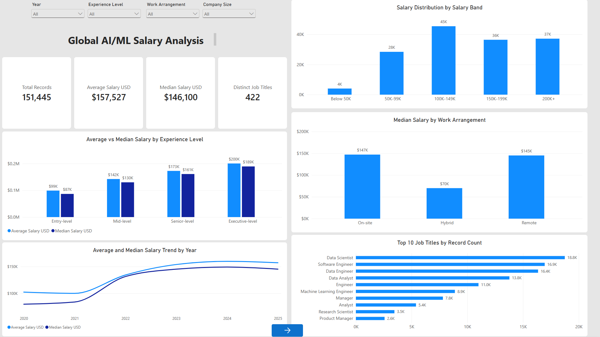
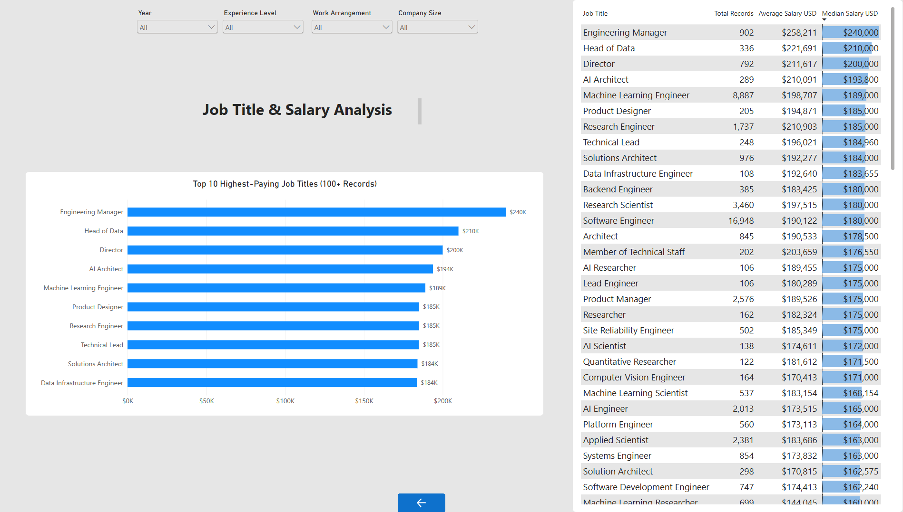

# Global AI/ML Salary Analysis

An end-to-end data analysis project exploring global AI, machine learning, and data science salaries from 2020 to 2025.

The project covers the complete analytics workflow: data understanding, cleaning, exploratory data analysis, MySQL integration, SQL analysis, and interactive Power BI dashboards.

## Dashboard Preview

### Overview



### Job Analysis



## Project Overview

The dataset contains **151,445 salary records** across **422 job titles** in AI, machine learning, and data-related roles.

The analysis investigates:

- Salary differences across experience levels
- Average and median salary trends by year
- Salary distribution across salary bands
- Salary differences by work arrangement
- Most common job titles
- Highest-paying job titles with sufficient sample sizes

## Key Insights

- The overall average salary is approximately **$157,527**.
- The overall median salary is approximately **$146,100**.
- Salary increases consistently with experience level.
- Executive-level roles have a median salary of approximately **$189K**.
- Engineering Manager has the highest median salary among job titles with at least 100 records, at approximately **$240K**.
- The largest salary group is the **$100K–$149K** band.
- Remote and on-site roles have similar median salaries, while the hybrid category contains a much smaller sample and should be interpreted carefully.
- Most records come from 2024 and 2025.

## Power BI Dashboard

The Power BI report contains two interactive pages:

### Overview

- Total records
- Average salary
- Median salary
- Distinct job titles
- Salary by experience level
- Salary trend by year
- Salary distribution
- Work arrangement comparison
- Top job titles by record count

### Job Analysis

- Top 10 highest-paying job titles
- Minimum sample requirement of 100 records
- Detailed salary table
- Conditional data bars
- Synchronized filters across report pages

[Download the Power BI dashboard](reports/global_ai_salary_dashboard.pbix)

[View the PDF report](reports/global_ai_salary_dashboard.pdf)

## Data Pipeline

```text
Raw CSV
   ↓
Python and pandas
   ↓
Cleaned CSV
   ↓
MySQL Database
   ↓
SQL Validation and Analysis
   ↓
Power BI View
   ↓
Interactive Dashboard
```

## Technologies Used

- Python
- pandas
- NumPy
- Matplotlib
- Seaborn
- Jupyter Notebook
- MySQL
- SQL
- Power BI
- Power Query
- DAX
- Git and GitHub

## Repository Structure

```text
global-ai-ml-salary-analysis/
├── data/
│   ├── raw/
│   ├── interim/
│   └── processed/
├── docs/
│   └── data_source.md
├── notebooks/
│   ├── 01_data_understanding.ipynb
│   ├── 02_data_cleaning.ipynb
│   └── 03_eda_analysis.ipynb
├── reports/
│   ├── figures/
│   ├── images/
│   ├── global_ai_salary_dashboard.pbix
│   └── global_ai_salary_dashboard.pdf
├── sql/
│   ├── 01_schema.sql
│   ├── 02_data_validation.sql
│   ├── 03_analysis_queries.sql
│   └── 04_power_bi_views.sql
├── src/
│   ├── database_connection.py
│   ├── load_to_mysql.py
│   └── .env.example
└── .gitignore
```

## Data Quality and Methodology

- Verified the number of records after cleaning and database loading
- Checked missing values and salary ranges
- Standardized salaries using `salary_in_usd`
- Created ordered categories for experience, salary bands, and company size
- Used median salary alongside average salary to reduce the effect of extreme values
- Required at least 100 records when ranking the highest-paying job titles

## Data Source

Dataset source and attribution details are documented in:

[`docs/data_source.md`](docs/data_source.md)